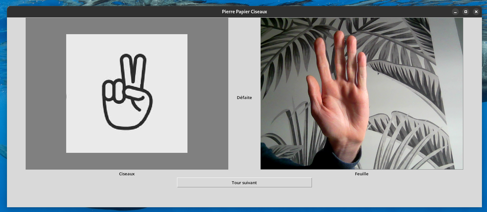

<div align="center">

# RPS_CV
Le jeu de Pierre-Papier-Ciseaux assisté par computer vision

</div>




## Introduction

Dans le cadre de notre cours de vision par ordinateur à Junia ISEN Lille, il nous a été demandé d’utiliser nos connaissances en computer vision dans un cas d'utilisation réel. Nous avons décidé de créer une application permettant de jouer à Pierre-Papier-Ciseaux en utilisant les formes réalisées avec nos mains.


## Technologies

Ce projet utilise :
- TensorFlow: 2.16.0
- Keras: 3.0.5
- Python: 3.12.1


## Structure

Ce projet est divisé en 3 modules dans le dossier `rps_cv` :
- **core** contient les entités (liens avec les ressources externes) et les services métier.
- **app** comprend les contrôleurs de l'interface graphique et les ressources statiques.
- **training** contient les ressources nécessaires à l'entraînement du modèle de computer vision.


Les fichiers `appconfig.py` et `coreconfig.py`, disponibles respectivement dans les modules **app** et **core**, vous permettent de modifier certains comportements des modules correspondants.


## Utilisation

Pour lancer ce projet, installer les dépendances nécéssaire (de préférence dans un environement virtuel):
``` bash
python3 -m pip install -r requirements_app.txt #( ou requirements_training.txt, si vous voulez créer votre propre modèle )
```
Puis lancer l’application avec :
```bash
python3 main.py
```
C'est aussi simple que ça.

Si vous souhaitez créer votre propre modèle le fichier `RockPaperScissors.ipynb` est disponible dans `rps_cv/training/` et est complètement indépendant du reste.


## Auteurs

Ce projet vous est proposé par [Célestin Captal](https://github.com/cc-ca) et [Gatien Vilain](https://github.com/GatienVilain).